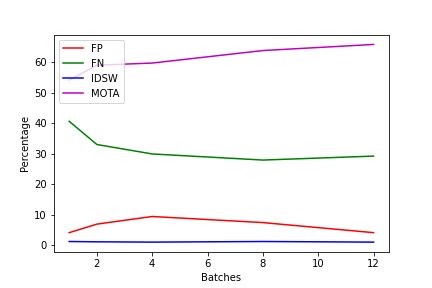
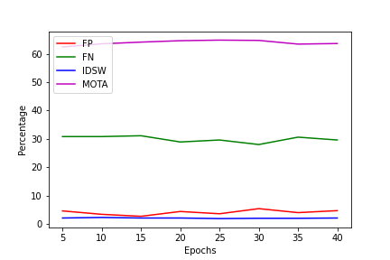

# Tracking Objects as Points
By: Maxmillan Ries (5504066), Nafie El Coudi El Amrani (4771338), Cristian Mihai Rosiu (), Jasper Konijn ()
Simultaneous object detection and tracking using center points:

## Introduction

Tracking objects in a given video or series of images is a common and useful computer vision procedure. In "Tracking Objects as Points", Xingyi Zhou uses the CenterNet Object Detection neural network-based algorithm to present a point-based framework for joint detection and tracking, referred to as CenterTrack. In this article, we will reproduce the algorithm described in this paper, and evaluate different parameters which were described. Specifically, we will train the principle algorithm using different hyperparameters known to affect neural networks, and using parameters unique to the tracking aspect provided by this paper.

## CenterTrack Basics

Xingyi Zhou's algorithm takes as an input several combinations of images. For the principle and most performing algorithm CenterTrack takes 2 timestamp images belonging to a video and a heatmap with the tracking points of the earlier timestamped image, as shown on the left of Figure 1. The tracked object points are obtained using the CenterNet network prediction.

|:--:|
| <b>Figure 1: Basic Input and Output of the CenterTrack network.</b>|

Using these three images as inputs, the CenterTrack algorithm outputs a set of tracking points for the recent timestamp, a bounding box size map and an offset map.

## Our Setup and Code Replication

As the CenterTrack github/paper provided clear details into the inner workings of their setup, including the optimization strategy, hyperparameters, and the various loss functions and their combinations, the reproduction of the paper aimed to evaluate key aspects of the paper. The experiments conducted were broken down into several categories listed below:

- Batch Size
- Epoch Count
- Optimization Functions
- Bounding Box Thresholds
- Heatmap Thresholds
- Combined Thresholds

----

### Batch Size
As we started our training experiments, we tried staying as close to the original setup parameters as possible. However, while the paper clearly states that a Titan Xp 12GB VRAM Graphics Card was used, a T4 with 16GB of RAM was found to be far lacking. As a consequence, we could use at most a batch of 12, in comparison to the paper's stated batch size of 32. 

Taking the lacking batch size as a source of inspiration, we retrained the basic CenterTrack network on varying batch sizes, resulting in the table below. All parameters were kept constant relative to the basic MOT half train/val split described in the paper, with only the epoch count being decreased though kept constant. 

| Batch Size | MOTA | FP | FN | IDSW |
| ----- | ----- | ----- | ----- | ----- |
| 1 | 54.1% | 4.1% | 40.6% | 1.2% |
| 2 | 59% | 6.9% | 33.0% | 1.1% |
| 4 | 59.7% | 9.4% | 29.9% | 1.0% |
| 8 | 63.8% | 7.4% | 27.9% | 1.2% |
| 12 | 65.8% | 4.1% | 29.2% | 1.0% |

|:--:|
| <b>Figure 2: Line chart showing the evolution of FP, FN, IDSW and MOTA over time.</b>|

Looking at the table above, the increase in the batch sizes seems to strongly correlate with an increase in the MOTA (Multiple Object Tracking Accuracy) and a general decreasein the FN count (False Negative). As a larger batch sizes allows a better estimation of the gradient, the general improvement in the accuracy seems fair and accurate to theoretical expectations.

The IDSW percentage (When objects are successfully detected but not tracked) generally remains constant, leading us to assume that the tracking is consistent, and the detection is lacking.

----

### Epoch Count
One of the observed difficulties when reproducing the CenterTrack paper was the time required to train. For a single epoch to train on a batch size of 12, it would take 12min24s on average. As the paper states to train for 70 epochs, the total training time for a single model would be ~14.5 hours.

To investigate the effect of batch size on the accuracy of CenterTrack, we trained the base model with different epoch counts, whilst maintaining the same parameters and train/val split as described in the paper. The results are shown below:

| Epoch Count | MOTA | FP | FN | IDSW |
| ----- | ----- | ----- | ----- | ----- |
|  5| 62.4% | 4.6% | 30.8% | 2.1% |
|  10| 63.5% | 3.4% | 30.8% | 2.3% |
|  15| 64.1% | 2.7% | 31.1% | 2.1% |
|  20| 64.6% | 4.4% | 28.9% | 2.1% |
|  25| 64.8% | 3.6% | 29.6% | 1.9% |
|  30| 64.7% | 5.4% | 28.0% | 2.0% |
|  35| 63.4% | 4.0% | 30.6% | 2.0% |
|  40| 63.6% | 4.7% | 29.6% | 2.1% |
----

The final results show a very constant trend over time. Unfortunately, with such a low epoch count it is quite hard to tell whether the model improves over time or not.To better visualize this, we plotted a line chart showing the trend of this 4 components over the span of 40 epochs.

|:--:|
| <b>Figure 3: Line chart showing the evolution of FP, FN, IDSW and MOTA over time. Overall, the lines are following a constant trend, with the FN and FP features presenting some small spikes in the middle and close to the end</b>|

### Optimization Functions
One of the assumed parameters of the CenterTrack is the usage of the Adam optimization function with a learning rate of 1.25e - 4. This specific choice of optimization function is left unmentioned in the paper, and we thought it interesting to evaluate what we recently learned in the Deep Learning course, and tried training the CenterTrack network on Momentum and RMSProp.
The expectation with the training is for Adam to perfom the best, with RMSProp coming in second and Momentum in third.

| Epoch Count | MOTA | FP | FN | IDSW |
| ----- | ----- | ----- | ----- | ----- |
| Momentum | 61.1% | 8.7% | 27.7% | 2.5% |
| RMSProp | 64.3% | 6.0% | 27.1% | 2.3% |
| Adam | 64.1% | 4.5% | 29.4% | 1.9% |

The results of our experiment indicate that the RMSProp optimization function best trained the network. While these results could not be verified with multiple runs (due to time constraints), this observation feels false. Firstly, the Adam optimization function builds on RMSProp, and combines it with Momentum to create a more robust function. 

Additionally, the IDSW column indicates, that the Adam trained network most succesfully tracked an object if it was detected (difference of at least 0.4). The FP count is also lower for Adam, leading us to believe that the models trained with RMSProp and Momentum made more incorrect detections, while the model trained by Adam made more conservative detections. This would explain why the RMSProp results appear better than that of Adams, though the difference is negiligible enough to not be considered significant.

----

### Bounding Box Threshold
The paper vaguely describes the θ thresholds as the "bounding box" confidence threshold. It does however describe that the MOTA is sensitive to the task-dependent output threshold θ. Additionally, the paper describes an optimal combination of threshold of θ = 0.5 and 𝜏 = 0.4 (see Heatmap Threshold section for 𝜏). In order to further learn about the influence of this parameter, we decided to investigate its effect on CenterTrack's performance.

The CenterTrack project comes with a series of optional parameters which can be set and modified manually for any training. After some reading into the various parameters available, we found that the --track_-_tresh parameter translated to the θ threshold.

| θ | MOTA | FP | FN | IDSW |
| ----- | ----- | ----- | ----- | ----- |
| 0 | 64.7% | 5.9% | 27.6% | 1.9% |
| 0.1 | 63.3% | 10.1% | 25.2% | 1.4% |
| 0.2 | 63% | 7.6% | 27.7% | 1.7% |
| 0.3 | 63.2% | 6.7% | 27.9% | 2.2% |
| 0.4 | 62.6% | 4.6% | 30.3% | 2.5% |
| 0.5 | 59.2% | 1.5% | 37.0% | 2.3% |

Observing the results of the experiment, one can clearly see that increasing the θ threshold results in a general decrease of the MOTA and the FP percentage, and an increase in both the FN and IDSW results. We see generally that higher bounding box threshold causes a decrease in performance. This decrease contradicts what was mentionned on the paper and can be explained with the difference in settings between the experiments on the paper and the settings we set up for ourselves. First, the bath size during these experiments was 8 instead of 32 as the authors did in the paper and low epoch counts. 

----

### Heatmap Treshold
In order to improve the tracking capabilities of CenterTrack, Xingyi Zhou introduced the usage of prior detections as an additional input. Using the point-based nature of the tracking to his/her advantage, CenterTrack renders all detections in a class-agnostic single-channel heatmap using a Gaussian render function. To avoid propagation of false positive detections, only the objects with a certain confidence score greater than threshold 𝜏 are rendered. This 𝜏 hyperparameters is specifically set by the user before training.

We chose to investigate the benefit of this parameter vis-a-vis the false positive propagation and general accuracy. In the CenterTrack implementation, this is alterable using the pre-thresh optional argument upon training and testing.

| 𝜏 | MOTA | FP | FN | IDSW |
| ----- | ----- | ----- | ----- | ----- |
| 0 | 64.7% | 5.9% | 27.6% | 1.9% |
| 0.1 | 63.4% | 6.1% | 28.5% | 2.0% |
| 0.2 | 62.9% | 4.2% | 30.6% | 2.4% |
| 0.3 | 65.5% | 4.4% | 28.2% | 1.8% |
| 0.4 | 63.6% | 4.7% | 29.3% | 2.4% |
| 0.5 | 65.1% | 5.5% | 27.5% | 1.9% |

Observing the table, we could not find a specific pattern which suggests that the 𝜏 thresholds truly reduces the propagation of false positive detections. The same observation can be seen in the number changes of the MOTA and false negatives. The results of this group of experiments can also be explained by the differnece in epoch count and small batch sizes ( 8 vs 32 ). 

As we couldn't run the expriments with higher epoch count and batch sizes, we can't say for sure that this trend of semi-random values will happen again in another experiment setting. Therefore, we conclude that these experiments are not representative of the performance of CenterTrack and need more investigation to be able to find an optimal value and reach numbers similar to the ones reported on the paper. 

----

### Combined Thresholds
In the previous sections, we elaborated on our experiments aimed at testing the influence of the bounding box and heatmap thresholds separately. The CenterTrack paper however clearly states that for the MOT17 dataset, a θ = 0.5 and 𝜏 = 0.4 combination is optimal according to their experiments.

Due to our limited timeframe, we investigated several combinations of θ and 𝜏, where both variables were equal, as depicted below:

| θ | 𝜏 | MOTA | FP | FN | IDSW |
| ----- | ----- | ----- | ----- | ----- | ----- |
| 0 | 0 | 43.5% | 31.5% | 24.0% | 1.0% |
| 0.1 | 0.1 | 64.7% | 7.8% | 26.3% | 1.2% |
| 0.2 | 0.2 | 65.9% | 6.3% | 26.4% | 1.3% |
| 0.3 | 0.3 | 64.0% | 5.1% | 29.0% | 2.0% |
| 0.4 | 0.4 | 62.6% | 3.5% | 31.5% | 2.4% |
| 0.5 | 0.5 | 58.2% | 1.8% | 36.8% | 3.2% |

Similar to the previous set of experiments, no clear trend can be observed in these test except a decrease in false positive as the values of both θ and 𝜏 get higher. This observation can probably be explained with the . The values seem to be optimal at θ = 0.2 and 𝜏 = 0.2. However, the decision to run the experiments with same values for both parameters was arbitrary. Therefore, we cannot say anything about the results of the experiments where both parameters are different (possible tests to run in the future to verify the claims of the paper). 

----

### Table 4 - MOT17
As instructed as part of the reproduction of the code, we investigate the results of Table 4 and attempted to reproduce them. While the exact results could not be perfectly reproduce, the method used to obtain each experiment was verified in conjunction with the mathematical notions denoted in the paper.

|  | MOTA | FP | FN | IDSW |
| ----- | ----- | ----- | ----- | ----- |
|  | % | % | % | % |
| w/o offset | 63.8% | 4.3% | 30.0% | 1.9% |
| w/o heatmap | 65.3% | 3.8% | 29.0% | 1.8% |
| Ours | 66.1% | 4.5% | 28.4% | 1.0% |

The principle difference with the results of Table 4 from the paper is that removing the offset is seen to be far more detrimental. While the FP count is similar, the FN and IDSW counts are higher than the paper's counterpart and the MOTA is substantially lower. To be perfectly honest, we are not sure why this is specifically the case. The paper does not properly describe how the experiments were specifically conducted for Table 4, beyond providing a general description of what each experiment aimed to investigate.

As we made sure to use the validation split of section 5.1, our suspicion is that the model were fully trained without using transfer-learning, with the crowdhuman provided model corresponding to the most successful training (the "Ours" training result).
Unfortunately, we did not have the time to investigate the possibility, as fine-tuning the pretrained network takes ~14.5 hours, and training the entire network from scratch would take over a day.

----

#### Conclusion
The CenterTrack paper presents itself as a fresh attempt at object detection and tracking based on a point-based system. While some of our results contradict the statements presented in the paper, notably with regards to the thresholds, the majority of our results follow the same interesting trends. For now, as we have not had the chance to evaluate the paper's results on a different dataset, we can only remain skeptical about the performance of the paper outside of it's testing domain. The author does however describe the project to work on video data, and the KTTI dataset, providing some confidence in its applicability. 

The only personal fault with the paper's results is the final optimal 66.1% accuracy, which generally makes this project harder to use in an interesting context, as its results feel unreliable (slightly better than a coin flip). We feel that the error propagation caused by the hierarchical structure (Detection -> Tracking) causes the mixed results, as the IDSW results consistently indicate that the Tracking is accurate, but the CenterNet detection is not. An investigation of another point-based detection network within the CenterTrack context could be very interesting.
